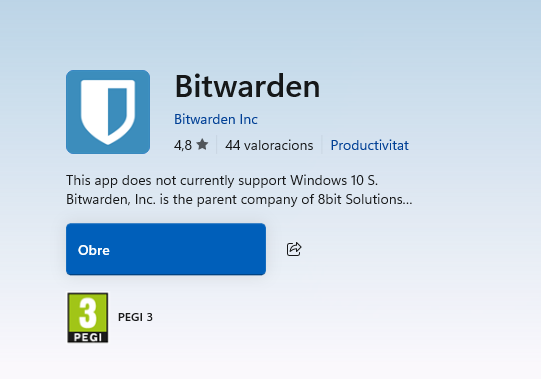
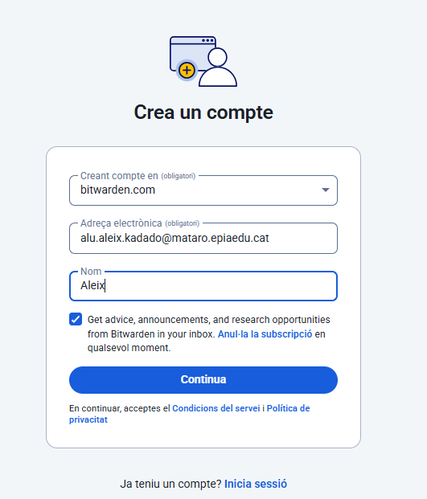
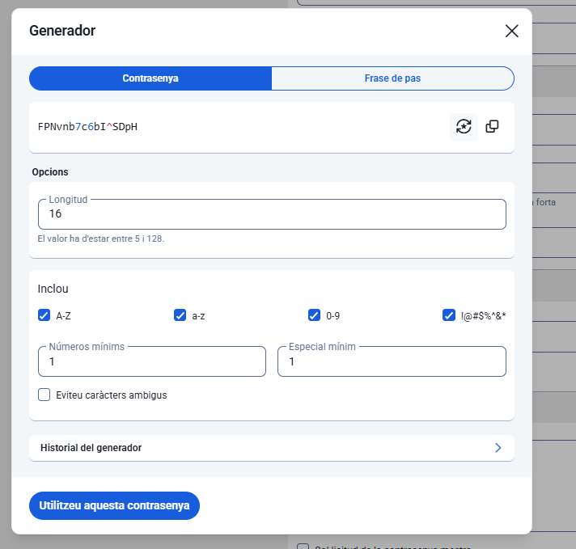
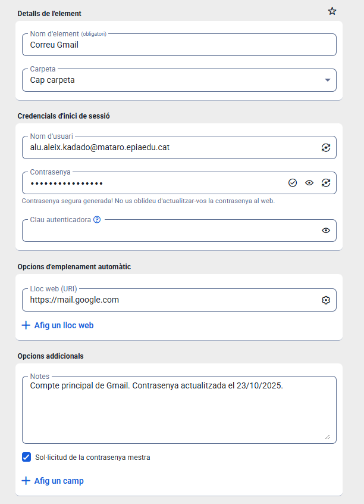
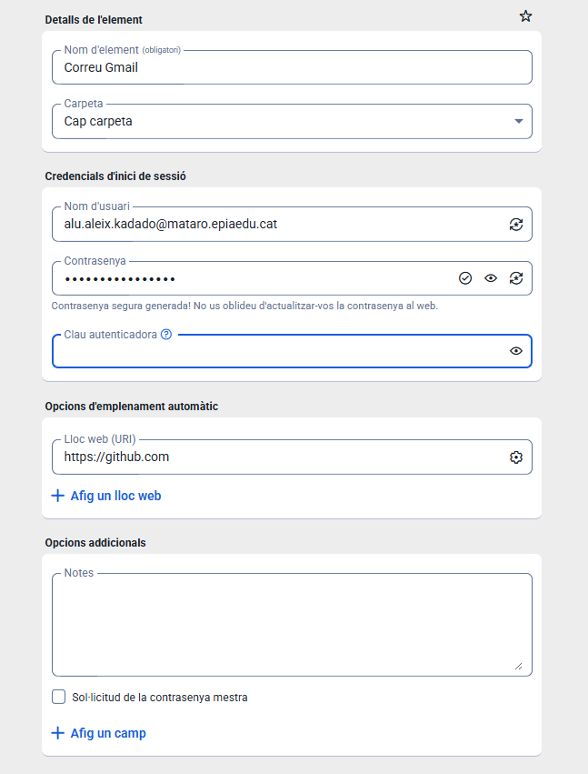
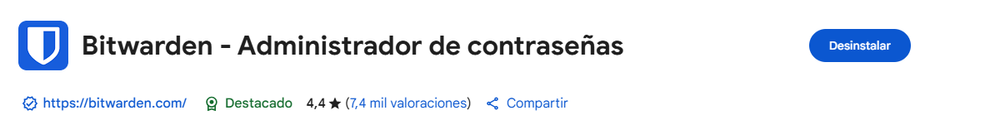
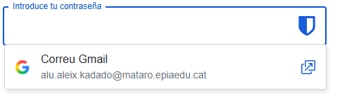

# 🧰 Guia d'Ús de Bitwarden

## 🔧 Instal·lació

Instal·lem des de **Microsoft Store** l’aplicació de **Bitwarden**.

## 👤 Creació de Compte

Ara crearem el nostre compte a Bitwarden.

## 🔐 Generador de Contrasenyes

Bitwarden inclou un generador de contrasenyes molt flexible:

- **Longitud:** 16 caràcters o més
- **Incloure:** majúscules, minúscules, números i símbols
- **Evitar caràcters similars:** opcional, per reduir errors de lectura

  

## 🔑 Generació de Contrasenyes Segures

Des del panell principal, prem **Generator** (icona de claus). Pots triar entre:

- Generar una **contrasenya aleatòria**
- Generar una **frase de pas**

Paràmetres recomanats:

- **Longitud:** 16 caràcters o més
- **Incloure:** majúscules, minúscules, números i símbols
- **Evitar caràcters similars:** opcional

  

## 💾 Desar Credencials

Desar una credencial d’una aplicació o servei web és molt senzill des del panell principal.

## 🌐 Extensió de Bitwarden

Instal·la l’extensió de Bitwarden al navegador per facilitar l’emplenament automàtic de contrasenyes.

## ✅ Confirmació

Confirmar que Bitwarden té la contrasenya per defecte guardada correctament.

## 🗂️ Còpies de Seguretat

Per fer una còpia de seguretat del teu magatzem de contrasenyes a Bitwarden:

1. Ves a **Tools**.
2. Selecciona **Export Vault**.
3. Introdueix la teva **contrasenya mestra** per confirmar l'operació.
4. Guarda el fitxer exportat al teu ordinador de forma segura.

