# T04: Serveis de directori LDAP

## 1️⃣ Configuració inicial del servidor

* Canviem el hostname a:

```bash
sudo hostnamectl set-hostname server.innovatech15.test


```
* Modifiquem el fitxer `/etc/hosts` per reflectir el nou hostname.

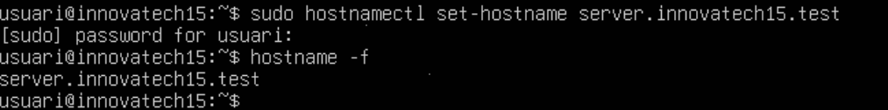

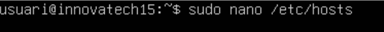

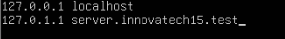


* Per establir comunicació amb l’amfitrió, configurem:

  * Una interfície de tipus **Host-Only**.
  * Un adaptador en **mode pont**.
    
  

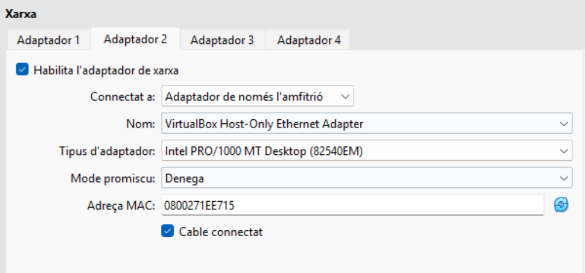 

* Editem la configuració de xarxa amb **netplan** segons la nostra topologia.

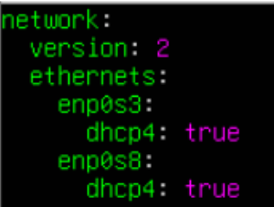 
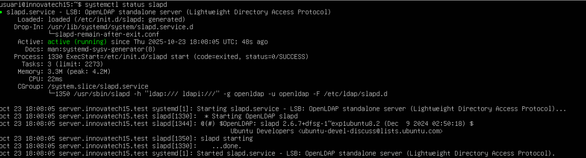 

 

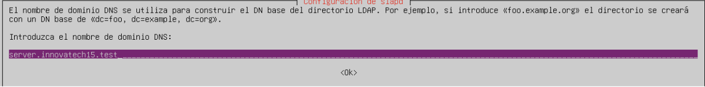 

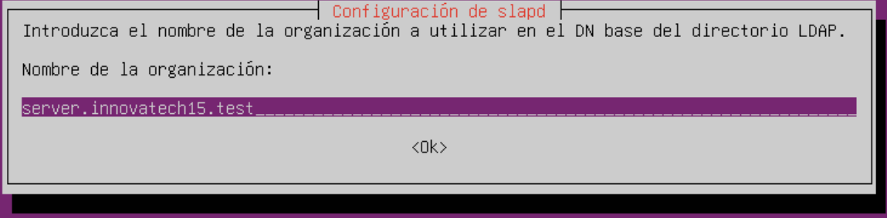 


## 2️⃣ Instal·lació i gestió de LDAP

* Comprovem l’estat del servei LDAP:

```bash
systemctl status slapd
```


* Si no està instal·lat, instal·lem el paquet:

```bash
sudo apt install slapd
```


* Verifiquem que el directori s’ha creat amb el **nom correcte**.

  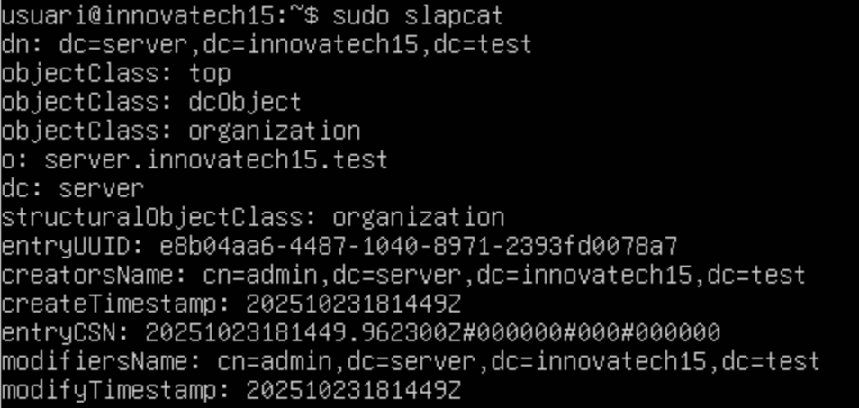 


## 3️⃣ Creació de les Unitats Organitzatives (OUs)

* Creem dues OUs: `users` i `groups`.

* Comanda per crear les OUs:

```bash
# Exemple de comanda ldapadd amb fitxer LDIF
ldapadd -x -D "cn=admin,dc=innovatech15,dc=test" -W -f ou.ldif
```

* Comprovació que les OUs s’han creat correctament:

```bash
ldapsearch -x -LLL -b "dc=innovatech15,dc=test" ou
```
 

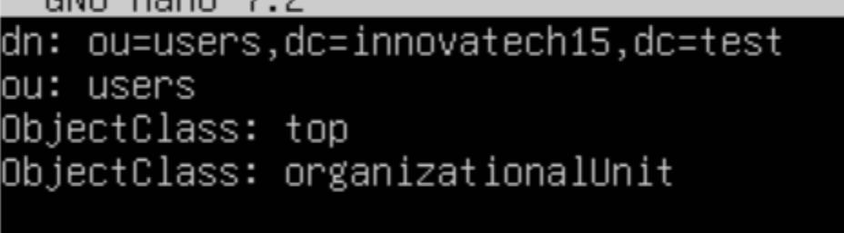 

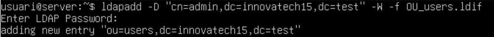 

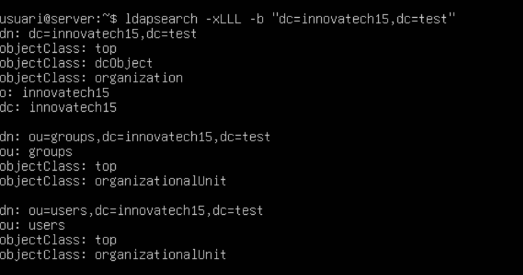 


## 4️⃣ Instal·lació del gestor LDAP (LAM)

  

* Entrem al gestor **LAM** amb la contrasenya de l’administrador `lam`.

* Amb el gestor, creem:

  * **2 usuaris:** `manager01` i `tech01`
  * **2 grups** corresponents.

* Canviem la contrasenya de l’administrador `lam` a `1234` per a l’inici de sessió.

* Comprovem que els noms s’han creat correctament i la resolució del servidor de domini funciona.


  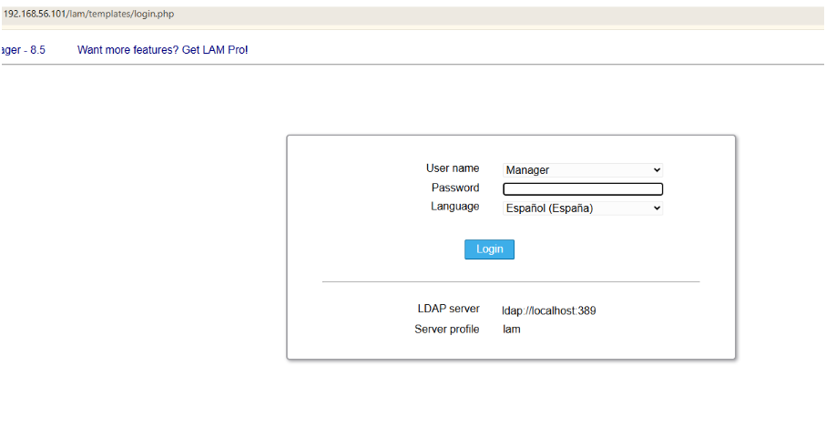

  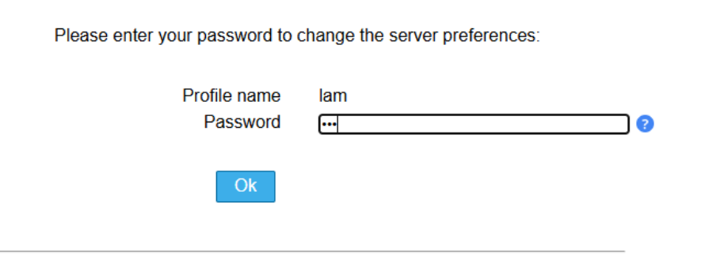

  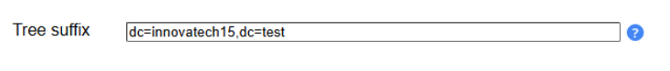

  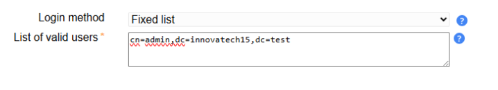

  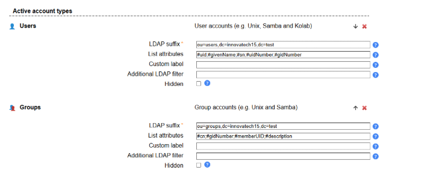

  

  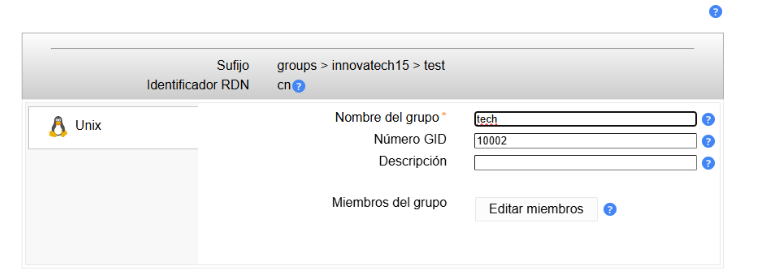

  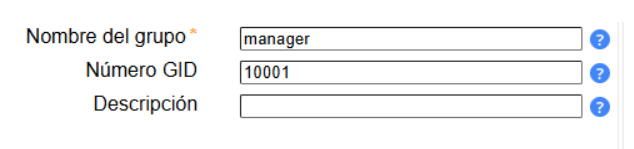

    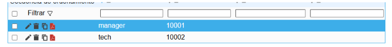

    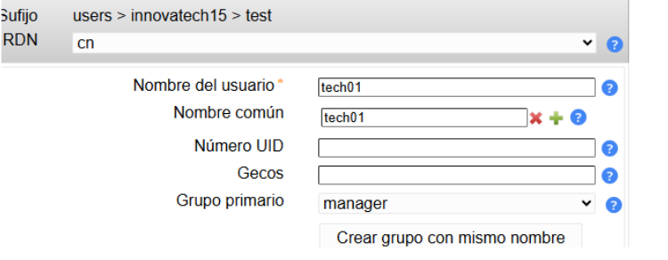

    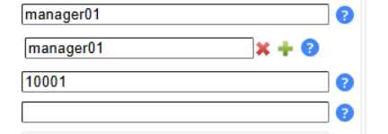

    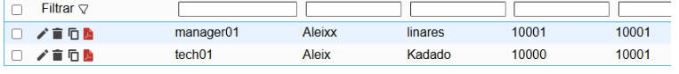 

## 5️⃣ Configuració del client LDAP

  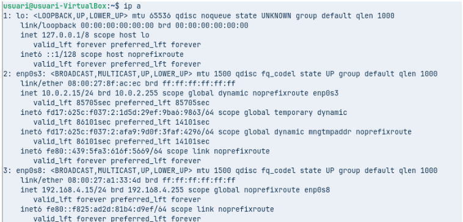 

  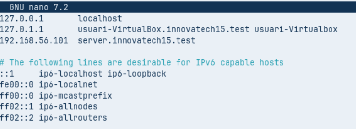 

   

* Instal·lem els mòduls d’autenticació LDAP:


```bash
sudo apt install libpam-ldap libnss-ldap nslcd

```

* Comprovem la connectivitat amb el servidor LDAP des del client:

```bash
ldapsearch -x -LLL -b "dc=innovatech15,dc=test" -H ldap://server.innovatech15.test
```


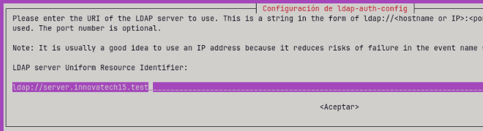

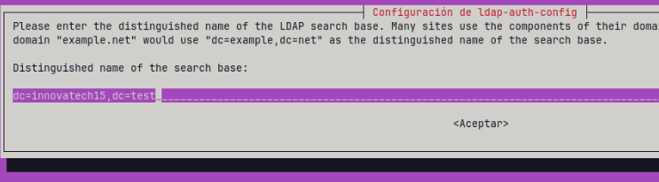

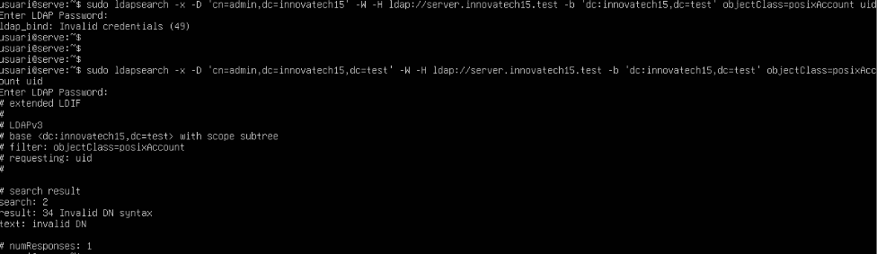

* Configurem `/etc/nsswitch.conf`:

  * Borrem el terme `use_authok`.
  * Afegim la línia següent per permetre la creació automàtica dels perfils d’usuari:
 
  

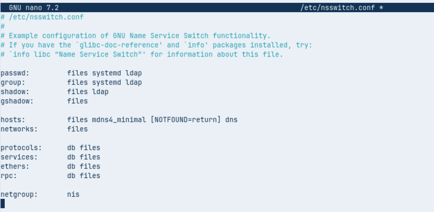


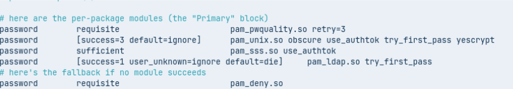


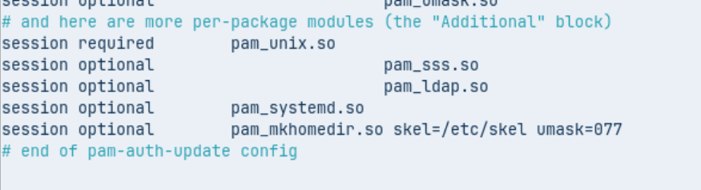


pam_mkhomedir.so skel=/etc/skel/ umask=0022
```

* Verifiquem que el sistema mostra correctament els usuaris provinents del directori LDAP.


## 6️⃣ Permetre l’inici de sessió gràfica

* Assegurem que els usuaris del domini LDAP poden iniciar sessió gràfica al sistema.
* Prova d’inici de sessió amb `manager01` o `tech01`.

